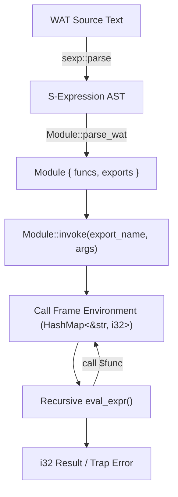

# Tiny WebAssembly (WAT) Interpreter

[](https://www.rust-lang.org/)
[](LICENSE)
[]()

A lightweight, robust interpreter for a core subset of the **WebAssembly Text format (WAT)** implemented in Rust. The interpreter parses folded S-expression WAT modules, constructs an abstract syntax tree (AST), and executes 32-bit integer arithmetic, conditionals, and deeply recursive function invocations with lexical call frame scoping.

---

## Features

- **Folded S-Expression Parser**: Parses WAT modules, function declarations, parameters, exports, and folded instruction trees using the `sexp` parser.
- **Lexical Call Frame Management**: Creates isolated environments for parameter bindings, enabling recursion for algorithms like Takeuchi, Ackermann, Fibonacci, and Euclidean GCD.
- **32-Bit Arithmetic Semantics**: Implements wrapping signed 32-bit integer arithmetic (modulo $2^{32}$) according to the WebAssembly specification.
- **Structured Control Flow**: Supports conditional branching (`if (result i32) ... (then ...) (else ...)`) and direct function calls (`call $name ...`).
- **Comprehensive Error Handling**: Returns structured `Result<T, String>` errors for runtime traps (e.g. division by zero in `i32.rem_s`), arity mismatches, undefined symbols, and malformed WAT inputs.
- **Dual Interface**: Usable both as a Rust library and as a standalone command-line driver.

---

## Architecture Overview



### Supported Instructions

| Instruction | WAT Syntax | Semantics |
|---|---|---|
| **Constant** | `(i32.const n)` | Pushes a signed 32-bit integer constant `n` (supports decimal and hex). |
| **Local Get** | `(local.get $name)` | Retrieves the runtime value of the named parameter. |
| **Add** | `(i32.add lhs rhs)` | Evaluates `lhs` and `rhs`, returns `(lhs + rhs) mod 2^32`. |
| **Subtract** | `(i32.sub lhs rhs)` | Evaluates `lhs` and `rhs`, returns `(lhs - rhs) mod 2^32`. |
| **Multiply** | `(i32.mul lhs rhs)` | Evaluates `lhs` and `rhs`, returns `(lhs * rhs) mod 2^32`. |
| **Remainder** | `(i32.rem_s lhs rhs)` | Evaluates signed remainder `lhs % rhs`. Division by 0 triggers a runtime error. |
| **Less Than** | `(i32.lt_s lhs rhs)` | Pushes `1` if `lhs < rhs` (signed), otherwise `0`. |
| **Conditional** | `(if (result i32) cond (then ...) (else ...))` | Evaluates `cond`; executes `then` when non-zero, otherwise `else`. |
| **Function Call** | `(call $name arg1 arg2 ...)` | Evaluates argument expressions and invokes `$name` in a new call frame. |

---

## Getting Started

### Prerequisites

- [Rust & Cargo](https://www.rust-lang.org/tools/install) (Edition 2021 or later)

### Installation & Build

Clone the repository and build with Cargo:

```bash
git clone https://github.com/durgesh-k-sharma/tiny-wat-interpreter.git
cd tiny-wat-interpreter
cargo build --release
```

---

## Usage

### Command-Line Interface (CLI)

The CLI driver allows executing functions from `.wat` files directly:

```bash
cargo run -- <path_to_wat_file> <exported_function_name> [arguments...]
```

#### Examples:

```bash
# Calculate 10th Fibonacci number -> 55
cargo run -- tests/fib.wat fib 10

# Takeuchi recursive benchmark -> 3
cargo run -- tests/tak.wat tak 6 4 2

# Ackermann function -> 61
cargo run -- tests/ackermann.wat ackermann 3 3

# Greatest Common Divisor of 48 and 18 -> 6
cargo run -- tests/gcd.wat gcd 48 18

# Primality test for 29 -> 1 (true)
cargo run -- tests/is_prime.wat is_prime 29
```

### Rust Library API

You can also use `tiny_wat_interpreter` directly as a Rust dependency:

```rust
use tiny_wat_interpreter::Module;

fn main() -> Result<(), String> {
    let wat = r#"
    (module
      (func $add (export "add") (param $a i32) (param $b i32) (result i32)
        (i32.add (local.get $a) (local.get $b))
      )
    )
    "#;

    let module = Module::parse_wat(wat)?;
    let result = module.invoke("add", &[15, 27])?;
    println!("Result: {}", result); // prints 42
    Ok(())
}
```

---

## Testing

Run the automated test suite comprising unit tests, edge-case checks, and benchmark validations:

```bash
cargo test
```

### Benchmark Test Cases Included:

- [`tests/fib.wat`](tests/fib.wat): Recursive Fibonacci calculation.
- [`tests/tak.wat`](tests/tak.wat): Takeuchi ternary recursive function.
- [`tests/ackermann.wat`](tests/ackermann.wat): Deeply nested Ackermann function.
- [`tests/gcd.wat`](tests/gcd.wat): Euclidean greatest common divisor algorithm.
- [`tests/is_prime.wat`](tests/is_prime.wat): Primality testing via trial division recursion.

---

## Project Structure

```
.
├── Cargo.toml          # Rust package configuration
├── Cargo.lock          # Dependency lockfile
├── README.md           # Project documentation
├── src/
│   ├── lib.rs          # Core AST, WAT parser, evaluation engine, & unit tests
│   └── main.rs         # Command-line driver application
└── tests/
    ├── ackermann.wat   # Ackermann benchmark WAT module
    ├── fib.wat         # Fibonacci benchmark WAT module
    ├── gcd.wat         # GCD benchmark WAT module
    ├── is_prime.wat    # Prime test benchmark WAT module
    ├── tak.wat         # Takeuchi benchmark WAT module
    └── interpreter_test.rs # Integration and edge-case test suite
```

---

## License

This project is licensed under the MIT License.

